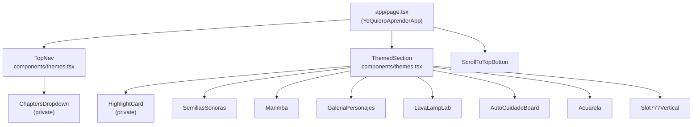

All interactive components in this project carry the `"use client"` directive. Because the book page itself is a client component (`app/page.tsx`), child components inherit that boundary — but experience components like `SemillasSonoras` and `GaleriaPersonajes` also declare `"use client"` independently so they can be reused inside the standalone session routes under `app/sesiones/`.

## ThemedSection

`ThemedSection` is the primary layout wrapper for every chapter and section in the book. It renders a `<section>` element with a consistent header (eyebrow label, title, description) and an optional grid of highlight cards above the main content area.

**File:** `components/themes.tsx`

```tsx
import { ThemedSection } from "@/components/themes";

<ThemedSection
  id="semillas"
  title="El cuidado de la semilla"
  eyebrow="Capítulo 01"
  description="Abrimos el camino preparando el terreno..."
  highlights={[
    { icon: '🌱', title: 'Siembra sonora', text: 'Cada semilla responde con una textura musical distinta.' },
    { icon: '🪴', title: 'Rituales de riego', text: 'Diseña rutinas breves para cuidar y registrar cambios.' },
  ]}
>
  <SemillasSonoras />
</ThemedSection>
```

### Props

<ParamField path="body.id" type="string" required>
  The HTML `id` attribute applied to the `<section>` element. Used as the scroll target and URL hash identifier (e.g. `"semillas"`, `"galeria"`).
</ParamField>

<ParamField path="body.title" type="string" required>
  The chapter heading rendered as an `<h2>` using the display font (Space Grotesk).
</ParamField>

<ParamField path="body.children" type="React.ReactNode" required>
  The main content of the section, rendered inside a sticker-style bordered container with a lavender offset shadow.
</ParamField>

<ParamField path="body.eyebrow" type="string">
  A short label shown above the title in a pill badge — typically the chapter number (e.g. `"Capítulo 01"`). Rendered with a sky-blue offset shadow.
</ParamField>

<ParamField path="body.description" type="string">
  A paragraph of introductory text displayed below the title and above the highlights grid.
</ParamField>

<ParamField path="body.highlights" type="Array<{ id?: string; title: string; text: string; icon?: string }>">
  An optional array of highlight items. When provided, they render as a responsive grid of `HighlightCard` components (2 columns on medium screens, 3 on extra-large). Each item's shadow color cycles through the four brand pastel colors.
</ParamField>

<ParamField path="body.className" type="string">
  Additional Tailwind classes merged onto the outer `<section>` element.
</ParamField>

### Layout details

- The section is `max-w-6xl` wide, centered, and has `scroll-mt-28` so it clears the sticky nav when jumped to.
- The first section on the page uses `first:mt-12`; subsequent sections use `mt-24`.
- The content wrapper is `rounded-[32px] border-2 border-black bg-white` with a fixed `10px 10px 0 #C0AAF2` box shadow.

---

## HighlightCard

`HighlightCard` is an internal component used exclusively by `ThemedSection`. It is not exported.

**File:** `components/themes.tsx` (unexported)

Each card receives a `title`, `text`, an optional `icon` emoji, and an `index`. The index is used to cycle through the four brand shadow colors (`#80C1DD`, `#F2AADC`, `#DCF2AA`, `#C0AAF2`) for visual variety.

```tsx
// Used internally by ThemedSection
function HighlightCard({
  title,
  text,
  icon,
  index,
}: {
  title: string;
  text: string;
  icon?: string;
  index: number;
}) { ... }
```

The card renders as an `<article>` with the `.sticker-card` utility class and receives the current cycle color via the `--shadow-color` CSS variable.

---

## TopNav

`TopNav` is the sticky navigation bar fixed to the top of the viewport. It renders the project logo, primary links (Inicio, Sobre, Créditos), a `ChaptersDropdown` for the six experiences, and a Presupuesto Participativo logo badge. On mobile it collapses to a hamburger button that opens a full-width panel.

**File:** `components/themes.tsx`

```tsx
import { TopNav } from "@/components/themes";

<TopNav current={tab} onChange={handleSectionChange} />
```

### Props

<ParamField path="body.current" type="string" required>
  The `id` of the currently active section. Used to apply an active/bold style to the corresponding nav button and to highlight the active chapter inside the dropdown.
</ParamField>

<ParamField path="body.onChange" type="(id: string) => void" required>
  Callback invoked when the user selects a section. The parent component uses this to call `scrollIntoView` and update the active tab state.
</ParamField>

### Behavior

- The nav is `sticky top-0 z-50` with a frosted-glass background (`bg-[#f4f4f6]/90 backdrop-blur`).
- The **Capítulos** dropdown opens a `ChaptersDropdown` panel listing all six chapters as sticker cards. The panel closes on outside click, Escape key, or when a chapter is selected.
- On mobile, a hamburger button opens a fixed overlay panel listing all sections and chapters. Opening the panel locks `document.body.style.overflow` to prevent background scrolling.
- `ChaptersDropdown` is a private sub-component defined in the same file; it is not exported separately.

---

## ScrollToTopButton

A floating action button that appears after the user scrolls more than 300 px down the page, and scrolls back to the top on click.

**File:** `components/ScrollToTopButton.tsx`

```tsx
import ScrollToTopButton from "@/components/ScrollToTopButton";

// Place at the bottom of the page layout
<ScrollToTopButton />
```

The component has no props. It manages its own visibility with a `useState`/`useEffect` scroll listener. It is styled with the sky shadow color (`#80C1DD`) and positioned `fixed bottom-8 right-8`.

---

## Section (legacy)

`components/ui.tsx` exports a simple `Section` component that predates the current `ThemedSection` design. It is not used in the main page but may be referenced in standalone session pages.

```tsx
import { Section } from "@/components/ui";

<Section id="example" title="My section">
  <p>Content</p>
</Section>
```

| Prop | Type | Description |
|---|---|---|
| `id` | `string` | HTML id for scroll targeting |
| `title` | `string` | Heading text |
| `children` | `React.ReactNode` | Section content |

---

## Experience components

Each creative experience is a self-contained client component. They accept no props from the parent page — all state is managed internally.

<AccordionGroup>
  <Accordion title="SemillasSonoras — components/SemillasSonoras.tsx">
    Seed sound gallery using the Web Audio API. Users interact with seeds that each produce a distinct musical texture or loop. Requires `"use client"` for audio context initialization.
  </Accordion>

  <Accordion title="Marimba — components/Marimba.tsx">
    An interactive digital marimba rendered on the page alongside `SemillasSonoras` inside the "El cuidado de la semilla" chapter. Uses the Web Audio API to synthesize percussive tones on key presses or taps.
  </Accordion>

  <Accordion title="GaleriaPersonajes — components/GaleriaPersonajes.tsx">
    3D character gallery built with `@react-three/fiber` and `@react-three/drei`. Loads character models in FBX format, places them on a 3D easel scene (`components/galeria/AtrilScene.tsx`), and configures adaptive camera framing based on model height. Uses `OrbitControls` for user navigation.
  </Accordion>

  <Accordion title="LavaLampLab — components/LavaLampLab.tsx">
    Interactive lava lamp simulation with custom WebGL shaders (`components/lava/LavaShaderPanel.tsx`). Guided steps walk the user through experimenting with blobs that react to clicks. Requires `"use client"` for canvas and animation frame management.
  </Accordion>

  <Accordion title="AutoCuidadoBoard — components/mesa/AutoCuidadoBoard.tsx">
    A 45-square cooperative board game about self-care. Simulates a dice roll using `useState` and `requestAnimationFrame` for animation. Cards show tips and questions based on the current square. The board layout is rectangular and uses CSS grid.
  </Accordion>

  <Accordion title="Acuarela — components/Acuarela.tsx">
    Canvas 2D painting experience that simulates watercolor blobs, color mixing, opacity layering, and wet texture. Users can export their painting as a PNG. Requires `"use client"` for canvas API access.
  </Accordion>

  <Accordion title="Slot777Vertical — components/slot/Slot777Vertical.tsx">
    A vertical slot machine (`Lever`, `Reel` sub-components in `components/slot/`) that combines creature parts at random to generate imaginary animals. The result serves as a creative writing prompt.
  </Accordion>
</AccordionGroup>

---

## Component dependency map


